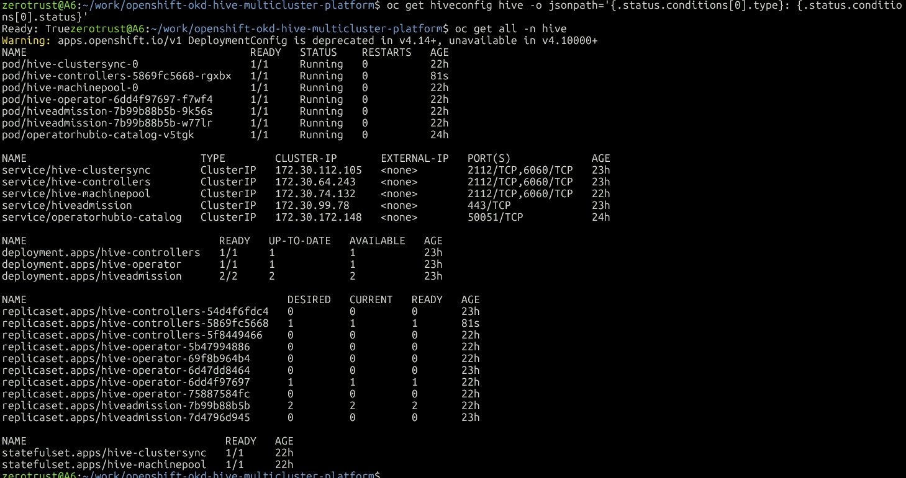
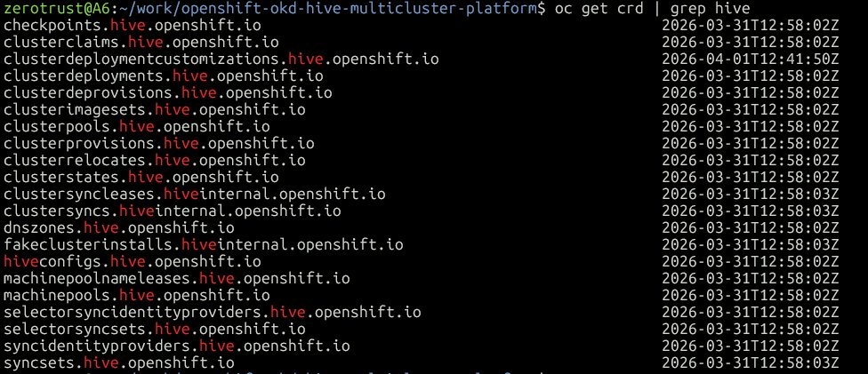

# openshift-okd-hive-multicluster-platform

> **Multi-Cluster Lifecycle Management on OKD** — Provisioning and GitOps-driven Day-2 operations using OpenShift Hive, ArgoCD, and HashiCorp Vault on a homelab OKD SNO management cluster.

[](https://okd.io)
[](https://github.com/openshift/hive)
[](https://argo-cd.readthedocs.io)
[](https://www.vaultproject.io)
[](LICENSE)

---

## 📐 Architecture Overview — Hub and Spoke

Ce projet implémente le pattern **Hub and Spoke** : l'OKD SNO homelab est le **hub** (management cluster), les clusters OKD provisionnés sur Azure sont les **spokes** (workload clusters autonomes).

```
┌─────────────────────────────────────────────────────────────────┐
│                  HUB — OKD SNO (homelab)                        │
│                  sno-master @ 192.168.241.10                    │
│                                                                 │
│  ┌───────────┐  ┌───────────┐  ┌──────────┐  ┌─────────────┐  │
│  │  ArgoCD   │  │   Hive    │  │  Vault   │  │  Keycloak   │  │
│  │ Community │  │ Operator  │  │  v0.28.0 │  │  OIDC SSO   │  │
│  └─────┬─────┘  └─────┬─────┘  └────┬─────┘  └─────────────┘  │
│        │              │             │                           │
│        │ GitOps       │ IPI         │ secrets injection         │
└────────┼──────────────┼─────────────┼───────────────────────────┘
         │              │             │
         │              │ Azure API   │
         │    ┌──────────┴──────┐     │
         │    │                 │     │
         ▼    ▼                 ▼     │
┌──────────────────┐   ┌──────────────────┐
│   SPOKE 1        │   │   SPOKE 2        │
│   OKD Cluster A  │   │   OKD Cluster B  │
│   Azure westeurope│  │   Azure westeurope│
│                  │   │                  │
│   ┌────────────┐ │   │   ┌────────────┐ │
│   │  masters   │ │   │   │  masters   │ │
│   │  (3 VMs)   │ │   │   │  (3 VMs)   │ │
│   ├────────────┤ │   │   ├────────────┤ │
│   │  workers   │ │   │   │  workers   │ │
│   │  (Spot)    │ │   │   │  (Spot)    │ │
│   └────────────┘ │   │   └────────────┘ │
│                  │   │                  │
│  ◄─ SyncSets ──► │   │  ◄─ SyncSets ──► │
│  ◄─ ArgoCD   ──► │   │  ◄─ ArgoCD   ──► │
└──────────────────┘   └──────────────────┘
  Autonome ✅                Autonome ✅
  (survit si hub OFF)        (survit si hub OFF)
```

---

## 🔄 Le pattern Hub and Spoke

Le hub **ne fait tourner aucune application métier**. Son seul rôle est de **gérer les spokes** :

```
HUB (OKD SNO homelab)
│
├── Hive      → crée / détruit / hiberne les clusters spokes
├── ArgoCD    → déploie les apps sur les spokes via ApplicationSet
├── Vault     → distribue les secrets aux spokes
└── Keycloak  → SSO centralisé pour tous les spokes

SPOKE (OKD Azure)
│
├── Reçoit ses configs depuis le HUB (SyncSets, ArgoCD)
├── Tourne tout seul si le HUB s'éteint  ✅
└── Ne connait pas les autres spokes
```

> **Analogie** : le HUB est la tour de contrôle aéroportuaire — elle donne les instructions.
> Les SPOKEs sont les avions — ils volent de façon autonome mais obéissent à la tour.

---

## 🔀 Hive vs HyperShift — deux approches du hub and spoke

*Voir [ADR-001 — Hive vs HyperShift](docs/adr/ADR-001-hive-vs-hypershift.md) pour la décision complète.*

```
┌─────────────────────────────────────────────────────────────┐
│              OKD SNO (homelab) = HUB commun                 │
└───────────────────────┬─────────────────────────────────────┘
                        │
           ┌────────────┴────────────┐
           │                         │
           ▼                         ▼
┌─────────────────────┐   ┌──────────────────────┐
│    HIVE (ce projet) │   │ HYPERSHIFT (companion)│
│                     │   │                       │
│  Spokes = vrais     │   │  Spokes = Hosted      │
│  clusters OKD       │   │  Control Planes       │
│  sur Azure          │   │  (pods sur le hub)    │
│  (masters + workers)│   │  + workers Azure      │
│                     │   │                       │
│  Cluster AUTONOME ✅│   │  Cluster dépendant ❌ │
│  Survit si hub OFF  │   │  du hub pour le CP    │
└─────────────────────┘   └──────────────────────┘
  → Enterprise lifecycle     → Dev/test, densité
    management                 multi-tenancy
```

| | **Hive (ce projet)** | **HyperShift** |
|---|---|---|
| Cluster cible | Autonome, full OKD stack | Hosted Control Plane (pods) |
| Azure workload | Masters + workers | Workers uniquement |
| Survie si hub OFF | ✅ Oui | ❌ Non |
| Coût cloud | Plus élevé | Faible |
| Provisioning | ~30–45 min (IPI) | ~5 min |
| Cas d'usage | Enterprise lifecycle | Dev/test, densité |

---

## 🎯 Target Architecture vs Lab Validation Strategy

Ce projet documente deux niveaux d'architecture : la **cible enterprise** (ce qu'on déploierait en mission) et la **configuration de validation** (ce qui est effectivement testé dans ce homelab).

### Target Architecture — Enterprise (2 clusters HA)

```
HUB — OKD SNO (homelab)
└── Hive ClusterPool "azure-okd-pool"
     ├── SPOKE 1 — OKD HA Cluster A (Azure westeurope)
     │    ├── 3 masters  Standard_D8s_v3  ON-DEMAND
     │    └── 2 workers  Standard_D4s_v3  Spot
     └── SPOKE 2 — OKD HA Cluster B (Azure westeurope)
          ├── 3 masters  Standard_D8s_v3  ON-DEMAND
          └── 2 workers  Standard_D4s_v3  Spot

Coût estimé : ~$400/mois (clusters actifs en permanence)
Cas d'usage  : production enterprise, lifecycle management réel
```

### Lab Validation Strategy — OKD SNO Spoke (~$1.50/session)

```
HUB — OKD SNO (homelab)
└── Hive ClusterDeployment "azure-okd-sno-spoke"
     └── SPOKE — OKD SNO (Azure westeurope)
          └── 1 VM  Standard_D8s_v3  ON-DEMAND (masters = pas de Spot)
              Provisioning ~45min → test → screenshots → destroy

Coût estimé : ~$1.50 par session de validation (3h)
Raison      : valider le concept Hive IPI end-to-end sans coût récurrent
```

> **Pourquoi pas Spot pour les masters ?**
> Les masters OKD portent le control plane (etcd + API server). Une éviction Azure Spot
> = cluster mort immédiatement. Les masters doivent impérativement tourner en ON-DEMAND.

> **Pourquoi pas k3s ou MicroShift comme spoke ?**
> Hive gère des clusters OpenShift/OKD natifs. Les SyncSets utilisent des APIs OpenShift
> (SCCs, Routes, Groups) qui n'existent pas sur Kubernetes générique. Un spoke k3s
> donnerait une démo partielle et trompeuse.

> **Pourquoi SNO et pas HA pour la validation ?**
> L'objectif est de valider le workflow Hive IPI end-to-end (ClusterDeployment → provisioning
> → SyncSets → ArgoCD). Un cluster SNO suffit pour cette validation. La topologie HA
> est documentée dans les manifests `clusterpools/azure-ha-pool.yaml`.

---


## 🔁 ClusterDeployment vs ClusterPool — Quand utiliser quoi ?

Hive propose deux approches pour provisionner des clusters spokes. Ce projet utilise les deux :

```
CLUSTERDEPLOYMENT — 1 cluster spécifique
──────────────────────────────────────────
ClusterDeployment "okd-sno-spoke"
└── provisionne 1 cluster SNO sur Azure
     ├── create → provisionne (~45 min)
     └── delete → destroy immédiat

Usage  : validation IPI end-to-end (~$1.50/session)
Contrôle : total — tu décides quand ça tourne


CLUSTERPOOL — N clusters pré-provisionnés
──────────────────────────────────────────
ClusterPool "azure-okd-pool"
├── Cluster A  ← hiberné, prêt à l'emploi
└── Cluster B  ← hiberné, prêt à l'emploi

ClusterClaim "dev-cluster"
└── réveille 1 cluster du pool
     └── lifetime: 8h → destroy auto

Usage  : équipes dev/test, clusters à la demande
Coût   : clusters toujours provisionnés $$
         (documenté dans clusterpools/azure-ha-pool.yaml)
```

---

## 🔄 Lifecycle complet — ClusterDeployment → SyncSets → ArgoCD ApplicationSet

C'est le cœur de ce projet : **3 mécanismes complémentaires** pour gérer le cycle de vie complet d'un spoke.

```
PHASE 2 — Hive provisionne le spoke
─────────────────────────────────────────────────────────────
ClusterDeployment CR appliqué
         │
         ▼
Hive appelle OpenShift Installer (IPI)
         │
         ▼
OKD SNO provisionné sur Azure (~45 min)
         │
         ▼
Hive crée automatiquement un Secret kubeconfig :
  metadata:
    labels:
      hive.openshift.io/secret-type: kubeconfig
      argocd.argoproj.io/secret-type: cluster  ← label magique ArgoCD !
  data:
    kubeconfig: <base64>


PHASE 3 — SyncSets poussent la config Day-2
─────────────────────────────────────────────────────────────
SyncSet détecté par Hive → appliqué automatiquement sur le spoke

SyncSet "baseline-security"
└── pousse sur le spoke :
     ├── Kyverno ClusterPolicies (deny privileged, restrict registries)
     ├── RBAC ClusterRoles (least-privilege)
     ├── NetworkPolicies (deny-all + allow-ingress)
     └── OAuth config (Keycloak hub → SSO sur le spoke)

→ Zéro intervention manuelle sur le spoke ✅
→ N clusters = N fois appliqué automatiquement ✅


PHASE 4 — ArgoCD ApplicationSet déploie les workloads
─────────────────────────────────────────────────────────────
ArgoCD détecte le Secret kubeconfig (label magique)
         │
         ▼
Spoke enregistré comme cluster cible ArgoCD
         │
         ▼
ApplicationSet generator: clusters
└── génère automatiquement 1 Application par spoke :
     ├── App "monitoring-spoke"   → déployée sur spoke ✅
     ├── App "cert-manager-spoke" → déployée sur spoke ✅
     └── App "security-spoke"    → déployée sur spoke ✅

→ 1 ApplicationSet = N clusters couverts ✅
→ Nouveau spoke provisionné = apps déployées auto ✅
```

### Les 3 mécanismes — rôles distincts

```
ClusterDeployment  = INFRA     (qui provisionne le cluster)
SyncSets           = CONFIG    (qui configure le cluster Day-2)
ArgoCD ApplicationSet = APPS   (qui déploie les workloads)

Les 3 ensemble = lifecycle management complet ✅
= ce que fait ACM/MCE en enterprise Red Hat
```

---

## 🗺️ Project Phases

```
Phase 1          Phase 2          Phase 3          Phase 4          Phase 5
────────         ────────         ────────         ────────         ────────
Hive             ClusterPool      Day-2            ArgoCD           Vault
Operator    →    Azure        →   SyncSets     →   ApplicationSet → Integration
Bootstrap        ClusterDeploy    (policies)        (cluster gen)   (cloud creds)
                 SNO spoke
✅ Complete      🔜 Planned       🔜 Planned       🔜 Planned       🔜 Planned
```

| Phase | Description | Config validée | Status |
|-------|-------------|----------------|--------|
| **Phase 1** | Hive operator deployment via ArgoCD on OKD SNO | Homelab ($0) | ✅ Complete |
| **Phase 2** | ClusterDeployment Azure SNO — validation IPI end-to-end | Azure SNO (~$1.50) | 🔄 In Progress |
| **Phase 3** | Day-2 via SyncSets — Kyverno policies + RBAC | Azure SNO (même session) | 🔜 Planned |
| **Phase 4** | ArgoCD ApplicationSet avec cluster generator | Azure SNO (même session) | 🔜 Planned |
| **Phase 5** | Vault integration — Azure credentials + PKI | Homelab ($0) | 🔜 Planned |

---

## 🏗️ Repository Structure

```
openshift-okd-hive-multicluster-platform/
│
├── README.md
├── SECURITY.md
│
├── docs/
│   ├── adr/
│   │   ├── ADR-001-hive-vs-hypershift.md
│   │   ├── ADR-002-hypershift-multiplatform-ha.md
│   │   ├── ADR-003-hive-provisioning-methods.md
│   │   ├── ADR-004-iam-strategy-keycloak.md
│   │   ├── ADR-005-oidc-brokering-dex-vs-direct.md
│   │   └── ADR-006-network-hub-spoke-azure.md
│   ├── argocd-components.md
│   ├── adr/
│   │   ├── ADR-001 → ADR-005
│   ├── demo/                         ← docs démo avec screenshots
│   │   ├── phase1-hive-bootstrap.md  ← ✅ Complete
│   │   ├── phase2-clusterdeployment.md
│   │   ├── phase3-syncsets.md
│   │   ├── phase4-applicationset.md
│   │   └── phase5-vault-integration.md
│   └── screenshots/
│       ├── phase1-hive-all-running.png
│       └── phase1-hive-crds.png
│
├── argocd/
│   └── applications/
│       ├── hive.yaml
│       └── clusterpools.yaml
│
├── manifests/
│   ├── hive/
│   │   ├── 01-namespace.yaml
│   │   ├── 02-operatorgroup.yaml
│   │   ├── 03-catalogsource.yaml
│   │   ├── 04-subscription.yaml
│   │   ├── 05-hiveconfig.yaml
│   │   └── 06-rbac-fixes.yaml
│   ├── clusterpools/
│   │   ├── azure-pool.yaml
│   │   └── cluster-imageset.yaml
│   ├── clusterdeployments/
│   │   └── example-claim.yaml
│   └── syncsets/
│       ├── kyverno-policies.yaml
│       ├── rbac-baseline.yaml
│       └── networkpolicies.yaml
│
├── applicationsets/
│   └── multicluster-apps.yaml
│
├── terraform/
│   ├── .gitignore
│   ├── .terraform.lock.hcl
│   ├── main.tf              ← Resource Group + DNS Zone Azure
│   ├── variables.tf
│   └── outputs.tf
│
├── vault/
│   └── policies/
│       └── hive-azure-policy.hcl
│
└── screenshots/
```

---

## 🔐 Security Highlights

```
Management cluster (HUB)              Spokes (Azure clusters)
────────────────────────              ───────────────────────
Vault                                 Kyverno policies (via SyncSets)
└── Azure SP credentials              ├── deny privileged pods
    injectés dans Hive pods           ├── restrict image registries
    (zéro secret en clair Git)        └── require resource limits

ArgoCD                                RBAC (via SyncSets)
└── GitOps-only, OIDC Keycloak        └── least-privilege ClusterRoles

OKD release images                    NetworkPolicies (via SyncSets)
└── pinned digests via                └── deny-all + allow-ingress
    ClusterImageSet
```

---


## 🌐 Matrice de flux réseau — Hub Homelab → Spoke Azure

> Voir [ADR-006 — Network Hub↔Spoke Azure](docs/adr/ADR-006-network-hub-spoke-azure.md) pour l'analyse complète.

### Flux réseau par composant

| Source | Destination | Port | Protocole | Phase | Requis |
|--------|------------|------|-----------|-------|--------|
| `hive-install-manager` (hub) | `management.azure.com` | 443 | HTTPS via tinyproxy | Provisioning | ✅ |
| `hive-install-manager` (hub) | `quay.io` | 443 | HTTPS via tinyproxy | Provisioning | ✅ |
| `hive-install-manager` (hub) | `spoke API LB` (Azure) | 6443 | HTTPS | Provisioning | ✅ |
| `hive-clustersync` (hub) | `spoke API LB` (Azure) | 6443 | HTTPS | Day-2 SyncSets | ✅ |
| `hive-controllers` (hub) | `spoke API LB` (Azure) | 6443 | HTTPS | Reconcile loop | ✅ |
| `argocd-application-controller` (hub) | `spoke API LB` (Azure) | 6443 | HTTPS | ApplicationSet | ✅ |
| `spoke VM` (Azure) | `quay.io` | 443 | HTTPS | Bootstrap | ✅ |
| `spoke VM` (Azure) | `keycloak.apps.sno.okd.lab` (hub) | 443 | HTTPS | SSO OAuth | ✅ |
| `spoke VM` (Azure) | `hub API` (homelab) | - | - | - | ❌ Non requis |

### Pourquoi Hive ≠ HyperShift sur Azure

```
HYPERSHIFT ❌                        HIVE SNO ✅
─────────────                        ──────────
Azure workers                        Hub homelab
  └── doivent joindre                  └── appelle Azure API (sortant)
       CP sur hub homelab                   crée VM spoke Azure
       via Azure LB public                       │
            │                                    ▼
            ▼                              Spoke SNO Azure
       Azure LB → 192.168.241.10           └── CP sur Azure VMs ✅
       ❌ BLOQUÉ                                 autonome ✅
       (LB public ne route                       hub n'a rien
        pas vers IP privée)                      à exposer ✅
```

---

## ⚙️ Hive — Composants, CRDs et pattern Operator/Controller

### Ce que Hive déploie dans le cluster

```
namespace: hive
│
├── DEPLOYMENTS
│   ├── hive-operator        ← cerveau de Hive, réconcilie le HiveConfig
│   ├── hive-controllers     ← réconcilie ClusterDeployment, ClusterPool...
│   └── hiveadmission (x2)  ← webhook de validation des CRs Hive
│
├── STATEFULSETS
│   ├── hive-clustersync     ← applique les SyncSets sur les spokes
│   └── hive-machinepool     ← gère les MachinePools des spokes
│
└── SERVICES
    ├── hive-controllers     ← metrics (2112) + pprof (6060)
    ├── hive-clustersync     ← metrics (2112) + pprof (6060)
    ├── hive-machinepool     ← metrics (2112) + pprof (6060)
    └── hiveadmission        ← webhook HTTPS (443)
```

### Le pattern Operator / Controller / CRD

```
┌─────────────────────────────────────────────────────────────┐
│  PATTERN KUBERNETES OPERATOR                                │
│                                                             │
│  CRD (Custom Resource Definition)                           │
│  └── "Nouveau type d'objet Kubernetes"                      │
│       ex: ClusterDeployment, SyncSet, ClusterPool           │
│                                                             │
│  CR (Custom Resource)                                       │
│  └── "Instance du nouveau type"                             │
│       ex: mon-cluster-azure.ClusterDeployment               │
│                                                             │
│  OPERATOR / CONTROLLER                                      │
│  └── "Surveille les CRs et agit en conséquence"            │
│       Reconcile loop :                                      │
│       1. Observe l'état actuel  (cluster Azure existe ?)   │
│       2. Compare à l'état désiré (ClusterDeployment CR)    │
│       3. Agit pour converger    (provisionne si manquant)  │
└─────────────────────────────────────────────────────────────┘
```

### Les 21 CRDs Hive — rôles détaillés

```
PROVISIONING (cycle de vie des clusters)
─────────────────────────────────────────
clusterdeployments          ← 1 CR = 1 cluster OKD provisionné
clusterpools                ← pool de clusters pré-provisionnés
clusterclaims               ← réclame un cluster d'un pool
clusterprovisions           ← suivi du provisioning en cours
clusterdeprovisions         ← suivi du destroy en cours
clusterimagesets            ← référence l'image OKD release
clusterrelocates            ← migration d'un cluster vers un autre hub
clusterstates               ← état courant d'un cluster
clusterdeploymentcustomizations ← customisation du install-config

DAY-2 OPERATIONS
─────────────────
syncsets                    ← ressources à appliquer sur les spokes
selectorsyncsets            ← syncsets avec sélecteur label
syncidentityproviders       ← config OAuth à pousser sur les spokes
selectorsyncidentityproviders

MACHINE MANAGEMENT
───────────────────
machinepools                ← pools de nœuds workers à gérer
machinepoolnameleases       ← gestion des noms de MachinePools

DNS
────
dnszones                    ← zones DNS gérées par Hive

CONFIGURATION
──────────────
hiveconfigs                 ← configuration globale de Hive (singleton)
checkpoints                 ← points de sauvegarde Hive

INTERNAL
─────────
clustersyncs                ← état de synchro des SyncSets
clustersyncleases           ← leader election pour clustersync
fakeclusterinstalls         ← clusters simulés pour tests
```

### Qui fait quoi — les 5 composants

```
hive-operator
─────────────
Rôle : réconcilie le HiveConfig CR
       crée/met à jour tous les autres composants Hive
       gère les RBAC, les deployments, les webhooks

Triggered by : HiveConfig CR modifié
Action        : crée hive-controllers, hiveadmission,
                hive-clustersync, hive-machinepool


hive-controllers
─────────────────
Rôle : cerveau du provisioning
       réconcilie ClusterDeployment, ClusterPool, ClusterClaim
       lance openshift-install pour provisionner les clusters

Triggered by : ClusterDeployment / ClusterPool / ClusterClaim CR
Action        : appelle API Azure/AWS
                lance un pod "hive-install-manager" éphémère
                qui exécute openshift-install create cluster


hive-clustersync
─────────────────
Rôle : applique les SyncSets sur les clusters spokes
       réconcilie en continu l'état désiré vs réel

Triggered by : SyncSet CR / SelectorsyncSet CR
Action        : se connecte au kubeconfig du spoke
                applique/met à jour les ressources définies
                dans le SyncSet sur le cluster distant


hive-machinepool
─────────────────
Rôle : gère les MachinePools des clusters spokes
       scale up/down les workers des spokes

Triggered by : MachinePool CR
Action        : crée/modifie les MachineSets sur le spoke
                via le kubeconfig stocké dans un Secret


hiveadmission (x2)
────────────────────
Rôle : webhook de validation
       valide les CRs Hive avant qu'elles soient acceptées

Triggered by : kubectl apply / oc apply d'une CR Hive
Action        : valide le ClusterDeployment (credentials OK ?)
                valide le SyncSet (format correct ?)
                → refuse si invalide (erreur immédiate) ✅
```

### Flow complet — ClusterDeployment → cluster OKD Azure

```
Tu appliques un ClusterDeployment CR
         │
         ▼
hiveadmission valide le CR ✅
         │
         ▼
hive-controllers détecte le nouveau CR
         │
         ▼
hive-controllers crée un pod éphémère :
"hive-install-manager-<cluster>"
         │
         └── exécute openshift-install create cluster
              │
              ├── appelle Azure API (credentials depuis Secret)
              ├── crée VNet, Subnet, NSG
              ├── crée VMs masters (Standard_D8s_v3 ON-DEMAND)
              ├── booste FCOS via Ignition
              └── cluster OKD SNO prêt (~45 min)
                       │
                       ▼
              hive-controllers stocke le kubeconfig
              dans un Secret avec label :
                argocd.argoproj.io/secret-type: cluster
                       │
                       ▼
              hive-clustersync applique les SyncSets
              sur le nouveau cluster ✅
                       │
                       ▼
              ArgoCD détecte le Secret kubeconfig
              → enregistre le spoke comme cluster cible
              → ApplicationSet déploie les apps ✅
```

### Screenshots — Phase 1 Complete

> **Fig 1** : `oc get all -n hive` — tous les composants Hive Running
> `docs/screenshots/phase1-hive-all-running.png`

> **Fig 2** : `oc get crd | grep hive` — 21 CRDs installées dont
> `clusterdeploymentcustomizations.hive.openshift.io`
> `docs/screenshots/phase1-hive-crds.png`

---

## 📸 Demo & Screenshots

Chaque phase dispose d'une documentation démo détaillée avec screenshots :

| Phase | Doc démo | Statut |
|-------|---------|--------|
| **Phase 1** — Hive Bootstrap | [docs/demo/phase1-hive-bootstrap.md](docs/demo/phase1-hive-bootstrap.md) | ✅ Complete |
| **Phase 2** — ClusterDeployment Azure | [docs/demo/phase2-clusterdeployment.md](docs/demo/phase2-clusterdeployment.md) | 🔄 In Progress |
| **Phase 3** — SyncSets Day-2 | [docs/demo/phase3-syncsets.md](docs/demo/phase3-syncsets.md) | 🔜 Planned |
| **Phase 4** — ArgoCD ApplicationSet | [docs/demo/phase4-applicationset.md](docs/demo/phase4-applicationset.md) | 🔜 Planned |
| **Phase 5** — Vault Integration | [docs/demo/phase5-vault-integration.md](docs/demo/phase5-vault-integration.md) | 🔜 Planned |

### Phase 1 — Aperçu

| Screenshot | Description |
|-----------|-------------|
|  | Tous les pods Hive Running (`oc get all -n hive`) |
|  | 21 CRDs Hive installées (`oc get crd | grep hive`) |

---

## 🔧 Prerequisites

| Component | Version | Notes |
|---|---|---|
| OKD SNO | 4.15 | Management cluster (homelab) |
| ArgoCD Community Operator | v0.17.0 | Already deployed ✅ |
| HashiCorp Vault | 0.28.0 | Already deployed ✅ |
| Keycloak | - | Already deployed ✅ |
| Hive Operator | v1.x | Deployed in Phase 1 |
| Azure subscription | Pay-As-You-Go | West Europe — ON-DEMAND for masters |
| OC CLI | 4.15 | `oc` and `kubectl` |

### 💰 Cost Summary

| Environnement | Usage | Coût estimé |
|---|---|---|
| Homelab OKD SNO | Phases 1, 5 | $0 |
| Azure OKD SNO spoke | 1 session ~3h (Phases 2-4) | ~$1.50 |
| **Total projet** | | **~$1.50** |

> Les manifests `clusterpools/azure-ha-pool.yaml` documentent la configuration HA enterprise
> (2 clusters × 3 masters + 2 workers) sans provisionnement continu (coût ~$400/mois).
> La validation IPI end-to-end est réalisée via un cluster SNO éphémère (~3h, destroy immédiat).

---

## 📚 Related Projects

| Projet | Description |
|---|---|
| [`Openshift-OKD-SNO-Airgap-workstation`](https://github.com/Z3ROX-lab/Openshift-OKD-SNO-Airgap-workstation) | Management cluster base (ArgoCD + Vault + Keycloak) |
| [`okd-hypershift-security-platform`](https://github.com/Z3ROX-lab/okd-hypershift-security-platform) | HyperShift — Hosted Control Planes sur Azure (companion) |
| [`okd-sno-supply-chain`](https://github.com/Z3ROX-lab/okd-sno-supply-chain) | Supply chain security (Cosign + Trivy + Harbor) |
| [`ai-security-platform`](https://github.com/Z3ROX-lab/ai-security-platform) | AI Security Platform on K3d |
| [`docs/adr/`](docs/adr/) | ADR-001→006 : Hive vs HyperShift, HyperShift HA, Hive Provisioning, IAM Keycloak, OIDC Brokering, Network Hub↔Spoke |
| [`docs/argocd-components.md`](docs/argocd-components.md) | ArgoCD components, Dex SSO flow, cluster targeting, spoke SSO patterns |

---

## 👤 Author

**Stéphane Seloi (Z3ROX)** — Cloud Native Security Architect / Platform Security Engineer
- 20+ years in telecom & cloud infrastructure
- CCSP | AWS Solutions Architect | ISO 27001 Lead Implementer
- [GitHub: Z3ROX-lab](https://github.com/Z3ROX-lab) | [Medium: @Z3R0X](https://medium.com/@Z3R0X)

---

*This project is part of a portfolio demonstrating enterprise-grade multi-cluster management capabilities for freelance Cloud Native Security Architect missions (750–850€/day, Île-de-France).*
